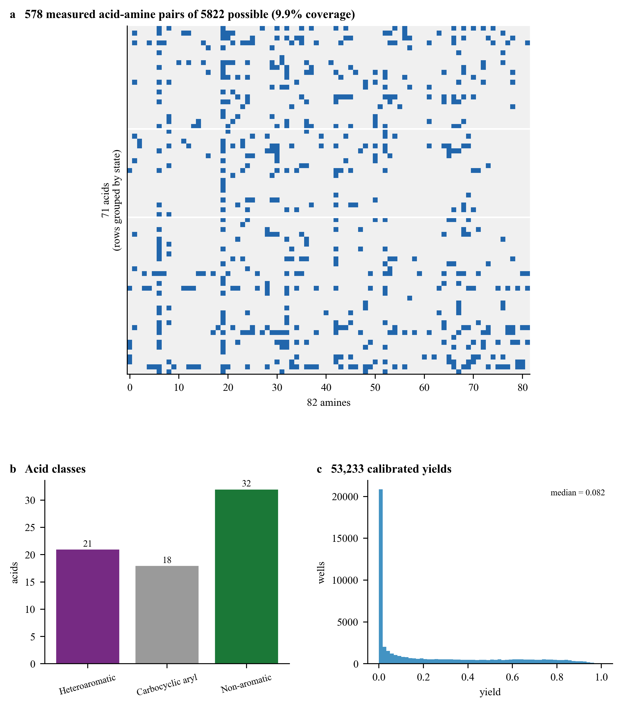
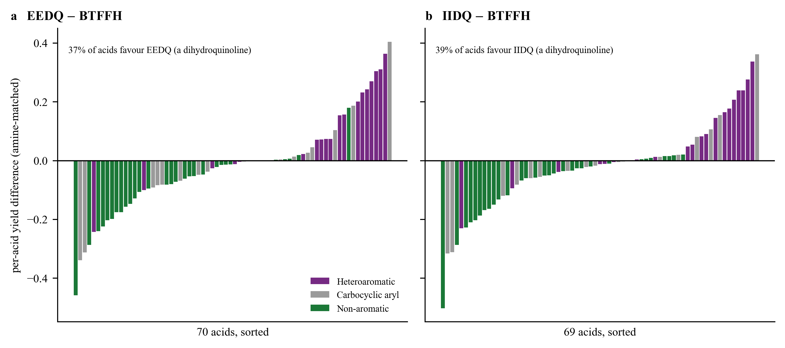
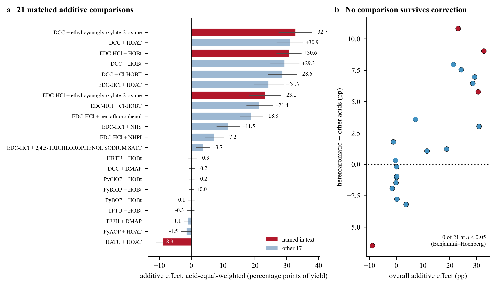
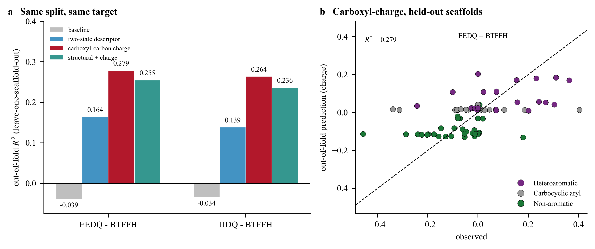

# Mapping the Substrate Dependence of Amide-Coupling Activators from a High-Throughput Reaction Screen

Kuangbiao Liao*

Guangzhou National Laboratory, Guangzhou 510005, China

\* Email: liao_kuangbiao@gzlab.ac.cn

---

## Abstract

Coupling reagents are chosen from rankings that treat one reagent as better than another whatever
is being coupled, and a retrospective analysis of a single in-house array of 53,233 calibrated
yields — 41 amide-coupling activators meeting a fixed library of 578 acid–amine pairs, incompletely
observed, in DMF at 25 °C for 2 h — shows that this assumption breaks down in a specific and checkable way. Matching each acid
to itself across conditions, exchanging BTFFH for EEDQ raises the per-acid yield for 26 of 70
matched acids and lowers it for 39 (5 unchanged), and the acids it raises are disproportionately heteroaromatic;
pooled to a standardised axis, the two dihydroquinolines separate cleanly, with no overlap, from
the eight haloformamidinium and carbodiimide conditions, while a triazine, a phosphate
benzotriazinone and an oxime phosphonium order the acids the same way as the dihydroquinolines —
the remaining conditions interleave rather than separate by reagent family. A class-level ranking oversimplifies on a second axis too: complete-formula matched
comparisons at fixed activator and base show additives change yield
by as much as 32.7 percentage points, and no class-by-additive
interaction was detected across 21 such comparisons after correction for multiple testing —
formulation needs to be retained alongside acid identity, not abstracted into a ranking. Reporting only the
descriptor a chemist can assign by eye would overstate how settled the acid-level preference is: a
single structural question — whether the ring system bearing the carboxyl group contains a
heteroatom — associates with it on acids whose scaffolds were held out (out-of-fold R² up to
0.164), but on the identical held-out split and target a calculated alternative, the carboxyl
carbon's partial charge, associates more strongly (R² up to 0.279), and combining the two gives no
further improvement, so within this comparison charge alone carries the stronger association.

---

## Introduction

Amide bond formation is the most frequently run transformation in medicinal chemistry [1–3], and
the literature that supports it is a literature of reagents. Carbodiimides [4,5], phosphonium and
aminium/uronium salts built on benzotriazoles and oximes [6–11], acyl halides generated by
haloformamidinium reagents [12,13], 2-alkoxy-1-alkoxycarbonyl-1,2-dihydroquinolines [14],
triazines [15,16], phosphorus(V) reagents [17,18], imidazolides [19] and mixed anhydrides [20,21]
have each been introduced, compared and tabulated [22–28]. Those comparisons are almost always
organised by reagent: which one gives higher yields, suppresses epimerisation, or copes with
hindered partners. Nearly all of this chemistry is stoichiometric in the activator; catalytic and
auxiliary-free routes have been proposed as lower-waste alternatives [29–32], motivated in part by
the same atom-economy and waste concerns raised for pharmaceutical-scale synthesis more broadly
[33,34]. This analysis is scoped to the stoichiometric activators still in routine use, not to those
alternatives.

That format carries a chemical assumption worth testing directly rather than assuming either way:
that the reagents can be put in an order that survives a change of substrate, so that a
recommendation transfers. A large single-transformation array run with solvent, temperature and time
fixed across every condition lets that assumption be checked acid by acid rather than asserted,
without a change in reaction medium confounding the comparison. Large, fixed-condition arrays
of this kind are themselves part of an established high-throughput approach to reaction data
[35,36,37], used to build informer libraries for methods evaluation [38,39] and, for the
amine–carboxylic-acid system specifically, to map the coupling condition space [40].
Machine-learning models trained on such data now predict yields or select conditions for other
transformations [41–47], with reviews of the field available separately [48,49]; closer to the
present system, multivariate linear regression on quantum-chemical descriptors, including the
acid's own electronic character, has been used to predict relative rate for a single activator
(carbonyldiimidazole) [50]; the comparison reported here instead asks whether a Gasteiger charge on
the acid can associate with the yield difference between activators, not with rate within one, and
a direct benchmarking study reports that sensitivity and robustness
remain in tension for amide-coupling yield models [51]. A separate model built from the same
platform predicts a numeric yield for amide coupling reactions [52]; it addresses a different
question, choosing among conditions for a given substrate rather than asking whether a reagent
ranking transfers across substrates, and does not test what is reported here.

This is a retrospective analysis of one such array: it reports where a reagent ranking holds, where
it does not, how large the exceptions are on the yield scale a chemist reads directly, and how far
a simple structural question can associate with the pattern on scaffolds the analysis never
saw. No reaction was run to test a prediction made by this analysis; the claims are associative and
are scoped accordingly throughout.

---

## Results

### The array: 578 measured pairs, three acid classes, one condition window

The data are one screen of an in-house ultra-high-throughput array: 53,233 calibrated yields over
578 acid–amine pairs, built from 71 carboxylic acids and 82 amines — 9.9% of the 5,822 combinatorially
possible pairs (Figure 1a) — against 94 conditions on 603 plates. Every condition runs in DMF at
25 °C for 2 h; the array varies only in activator (41 distinct), additive (10) and base (7), so
solvent, temperature and time cannot confound a reagent comparison.

Each acid is classified by one structural rule, fixed before any Stage 1
quantity was computed (Supplementary Note 2). Take the
carboxyl carbon and the atom it is attached to. If that atom is aromatic and the fused aromatic
ring system it belongs to contains a heteroatom, the acid is **heteroaromatic** — furoic,
thiophene-, pyridine-, pyrimidine- and benzothiophenecarboxylic acids and the like (21 acids,
Figure 1b). If the atom is aromatic in an all-carbon ring system, the acid is **carbocyclic aryl**
(18): benzoic acids, naphthoic acids. Otherwise it is **non-aromatic** (32) — aliphatic, benzylic
or alkenyl, including phenylacetic and diphenylacetic acids, where an sp³ carbon separates the ring
from the carboxyl group. The rule needs no computation: it is applied by looking at a drawn
structure. The analysis below uses the two-state form of the rule, heteroaromatic against
everything else; the carbocyclic aryl and non-aromatic classes separate in the direction one would
expect but not reliably enough to build on (p between 0.029 and 0.076 depending on which acids the
amine matching retains), and no claim here depends on separating them.

**Figure 1 | The array: coverage and composition.**
**a**, Measured acid–amine pairs (blue) among the 71 × 82 = 5,822 combinatorially possible pairs,
rows grouped by acid state. 578 pairs measured, 9.9% coverage.
**b**, Acid counts by state. **c**, Distribution of all 53,233 calibrated yields; median 0.082.

### Exchanging BTFFH for EEDQ or IIDQ: a per-acid effect, not a uniform one

Three conditions in the array differ in the activator and in nothing else: 1.5 equiv activator,
DIPEA (3.0 equiv), DMF, 25 °C, 2 h — BTFFH, EEDQ and IIDQ. Matching each acid to itself across the
pair and taking the amine-matched difference gives one number per acid rather than one number per
class (Figure 2). EEDQ gave a higher matched mean yield than BTFFH for 26 of 70 acids (37%), a lower
one for 39 (56%), and the same yield for the remaining 5; the corresponding counts for IIDQ were 27
of 69 (39%) higher, 40 (58%) lower, and 2 unchanged. Heteroaromatic acids are enriched among the
acids each quinoline raises: 14 of the 21 heteroaromatic acids come out ahead under EEDQ, and the
same 14 under IIDQ — two-thirds of the class, versus 12 of 49 (EEDQ) and 13 of 48 (IIDQ) among the
remaining acids. The class means make the same point on
the yield scale: EEDQ raises the 21-acid heteroaromatic mean from 8.8% to 19.1% while lowering the
31-acid non-aromatic mean from 18.7% to 9.4%. Heteroaromatic acid class is therefore a reasonable
prior for which quinoline direction to expect — right for 14 of 21 (67%) heteroaromatic acids and,
excluding ties, for about three-quarters of the remaining acids (74% and 72% for the EEDQ and IIDQ
comparisons respectively) — but not a rule: a chemist deciding on one specific acid needs the
acid-level comparison, not the class mean, to know which side of that split it falls on.

Pooling across the wider array sharpens the same pattern. Standardising each acid's yield within a
condition (z-score across the 71 acids) and taking the mean z of the heteroaromatic acids minus the
non-aromatic acids gives an axis coordinate for each of the 46 single-activator conditions in the
array (no additive, more than 300 wells; Supplementary Figure S1). The two dihydroquinolines,
EEDQ and IIDQ, sit at the positive extreme (+0.77 and +0.74) and the eight haloformamidinium and
carbodiimide conditions occupy the negative extreme (−0.91 to −0.40), with no overlap between the
two families. Across all 46 conditions, the dispersion of the axis coordinates (SD 0.396) exceeds a
shuffled-label null (median SD 0.202, p < 0.001). This axis correlates with condition mean yield
(r = 0.566), but the two quinoline conditions are among the least productive in the array (mean
yields 13.9% and 13.8%, against 49% for HATU), so the separation is not simply "the good conditions
happen to favour heteroaromatic acids": removing the two quinolines and re-testing on the remaining
44 conditions still returns an axis dispersion above a permuted null (p = 0.002), and a triazine
(CDMT, +0.58), a phosphate benzotriazinone (DEPBT, +0.46) and an oxime phosphonium (PyOxim, +0.30)
— three chemically unrelated reagent classes — order the acids the same way as the
dihydroquinolines. Pooled against the eight opposing conditions, this trio alone gives a
heteroaromatic-minus-non-aromatic contrast of +1.05 standardised units (95% CI +0.63 to +1.45,
p < 0.0001). As a separate check spanning the full 94-condition set rather than only the 46 used
for the axis, the two quinoline conditions and the 48 haloformamidinium/carbodiimide conditions
together give 96 quinoline-versus-other comparisons with a mean raw class double difference of
11.1 percentage points; a symmetrised background distribution over the remaining 4,275 non-target
condition pairs in the array reaches that raw-scale separation in 6.85% of pairs (Supplementary
Figure S2, SI Note 10).

**Figure 2 | The raw per-acid effect of exchanging BTFFH for EEDQ or IIDQ.**
**a**, EEDQ − BTFFH, one bar per acid (amine-matched, n = 70 acids with a shared amine at both
conditions), sorted, coloured by acid state. 37% of acids favour EEDQ.
**b**, IIDQ − BTFFH (n = 69 acids), same construction. 39% of acids favour IIDQ. In both panels 14
of the 21 heteroaromatic acids favour the quinoline, but the effect is graded and the classes
overlap substantially — 5 of 21 for EEDQ and 6 of 21 for IIDQ still favour BTFFH.

### Additives change yield by up to 32.7 points, and the class interaction does not survive correction

A class-level activator ranking oversimplifies for a second reason too: it also fixes the rest of
the recipe as if additive and base did not matter. Twenty-one
pairs of conditions in the array share the same activator and base and differ only in whether an
additive is present, letting that assumption be tested directly rather than assumed. The
acid-equal-weighted effect of adding the additive, holding activator and base fixed, ranges from
−8.9 percentage points (HATU/DIPEA + HOAt, 3 equiv) to +32.7 points (DCC + Oxyma, 1.5 equiv;
Figure 3a); EDC·HCl + Oxyma gives +23.1 points and EDC·HCl/NMM + HOBt gives +30.6 points (HOBt is
typically supplied and stored wetted, since the dry solid is explosive [53]). The sign tracks
activator chemistry cleanly: the 12 comparisons that pair a carbodiimide (DCC or EDC·HCl) with an
active-ester-forming additive (HOAt, HOBt, Cl-HOBt, an Oxyma-type oxime, a phenol, NHS or NHPI) —
built from three shared no-additive baselines (C47, C77, C87), not twelve independent activator
pairs — are all positive, from +3.7 to +32.7 points, while the 8 comparisons on a preformed,
non-carbodiimide activator (aminium, uronium, phosphonium or haloformamidinium) range only from
−8.9 to +0.3 points, with no overlap between the two ranges — consistent with the established role
of these additives in converting the carbodiimide-derived O-acylisourea into a more selective
active ester before it can rearrange to the unreactive N-acylurea, a step a preformed,
already-activated reagent does not need [9–11,22–25]. The one carbodiimide comparison that breaks
the pattern, DCC + DMAP (+0.2 points), pairs the carbodiimide with a nucleophilic acyl-transfer
catalyst rather than an active-ester-forming additive, consistent with the same reading. These are
substantial, formulation-dependent changes on the yield scale a chemist reads directly, and they
say that additive and base identity need to be retained, not abstracted away, when interpreting an
activator's response.

Whether an additive's effect itself depends on acid class is a separate question. Splitting each
additive's effect by heteroaromatic against other acids and testing the difference by permutation,
the smallest raw p-value among the 21 is 0.0061 (HATU + HOAt: −6.5 points more negative for
heteroaromatic acids); after Benjamini–Hochberg correction across all 21, no comparison reaches
q < 0.05 (Figure 3b). No acid-class interaction was detected in this screen; that is not the same
as showing one does not exist, and none is claimed.

**Figure 3 | Additive effects at matched activator and base.**
**a**, The acid-equal-weighted effect of adding an additive, for all 21 matched no-additive/with-additive
condition pairs in the array; error bars are a 95% percentile bootstrap over acids. Four comparisons
named in the text are highlighted.
**b**, The same 21 comparisons: overall additive effect against the heteroaromatic-minus-other
class interaction. No comparison's interaction survives Benjamini–Hochberg correction across all 21
at q < 0.05.

### A structural question and an electronic one, compared on the same split

The retrospective comparison in Figure 4 builds on an earlier descriptor contest (Supplementary
Note 2). After the primary response's Stage 1 scoring, a diagnostic showed that response was built on a mode whose
condition-side component tracks which conditions are more productive rather than which acids they
prefer (r = 0.879 between that component and condition mean yield). A productivity-orthogonalised
response was added alongside it — the original result stands and is reported in full — and the
miss was logged as an amendment rather than repaired quietly.

Whether the ring-heteroatom rule carries to acids not in the array was tested by holding out each
acid's entire Bemis–Murcko scaffold (32 scaffolds among 71 acids, largest holds 25) and predicting,
out of fold, the raw per-acid EEDQ − BTFFH and IIDQ − BTFFH differences reported
above. On this target and this leave-one-scaffold-out split, the two-state descriptor reaches
out-of-fold R² = 0.164 (EEDQ − BTFFH) and 0.139 (IIDQ − BTFFH), well above a train-fold-mean
baseline (R² ≈ −0.04 on both, the small negative value expected of a mean-only baseline under this
split). On the identical split and target, the carboxyl carbon's calculated Gasteiger partial
charge — a continuous, one-number-per-acid electronic descriptor — reaches R² = 0.279 and 0.264
respectively (Figure 4), outperforming the two-state descriptor on both in observed out-of-fold R².
The two descriptors correlate with each other at r = 0.704 (class means 0.350 heteroaromatic, 0.336
carbocyclic aryl, 0.313 non-aromatic acid). Fitting both together under the same split does not
improve on charge alone: the joint model reaches R² = 0.255 (EEDQ − BTFFH) and 0.236
(IIDQ − BTFFH), below the charge-only figures on both targets (Figure 4a); the estimated partial
correlations between the structural descriptor and the target, controlling for charge, are small
but nonzero (partial r = 0.15 and 0.11). Adding the structural indicator to charge therefore gives no
observed improvement in out-of-fold R² on either target within these linear models: charge alone
is the stronger association here, an empirical result about predictive performance on
this comparison rather than a claim about mechanism. A
full 18-descriptor block and a 2,048-bit ECFP4
fingerprint [54] do not outperform the two-state descriptor's regression R² on a related,
family-averaged target (Supplementary Figure S3, SI Note 3, which also reports a classification
form where the full block scores marginally higher); more features did not help on this metric and
target, though other targets or metrics could differ.

**Figure 4 | Two-state descriptor against carboxyl-carbon charge, same split, same target.**
**a**, Out-of-fold R² (leave-one-scaffold-out) for a train-fold-mean baseline, the two-state
ring-system descriptor, the carboxyl-carbon Gasteiger charge, and the two fitted jointly, predicting
the raw EEDQ − BTFFH and IIDQ − BTFFH differences of Figure 2. The charge descriptor outperforms the
two-state descriptor on both targets, and the joint model does not improve on charge alone.
**b**, Observed against out-of-fold predicted EEDQ − BTFFH for the charge descriptor, coloured by
acid state; R² = 0.279.

---

## Discussion

Read across the four results above, the practical reading is a change of question rather than a
reagent recommendation. A ranking that ignores which acid is being coupled is not simply
incomplete — for the specific comparison examined here, the heteroaromatic class correctly points
toward the quinoline for about two-thirds of its members, and the remaining acids correctly point
toward BTFFH about three-quarters of the time (excluding ties), so a class-based rule is a workable starting prior
but wrong often enough (roughly one acid in four) that it should not stand in for an acid-level
check. What generalises better is a structural or electronic association that a chemist can read
from a drawn structure or a calculated charge, applied as a soft prior rather than a hard rule. A
class-level description is incomplete on a second axis too: a reagent's specific
formulation — which additive, at what loading — is a substantial source of yield variation, and no
acid-class interaction in that effect was detected in this screen, so retaining the full recipe
matters even once the acid-level preference is known. The heteroaromatic end of the activator axis
itself rests on two dihydroquinoline reagents, EEDQ and IIDQ, each measured only once and so
without an independent experimental replicate; Supplementary Figure S1 and SI Note 7 bound what
that costs, and a triazine, a phosphate benzotriazinone and an oxime phosphonium reaching the same
ordering from three unrelated chemical families is the strongest available check on it, not a
substitute for a replicate measurement of either dihydroquinoline.

The two descriptors compared here, ring-system state and carboxyl-carbon charge, are correlated
structural and charge-based descriptors, in the spirit of the classical electronic and steric
substituent parameters developed for structure–reactivity correlations [55,56]; on this target and
split, charge matches or exceeds the two-state descriptor alone and gains nothing from it in
combination, an observed predictive result rather than a mechanistic ranking of the two. This
analysis reports both regardless, because a reader who can only read a structure by eye still gains
a useful, if weaker, prior from it, and because the ranking between the two on this specific
evaluation is an observation from one split and one pair of targets, not a claim that generalises
to every amide-coupling dataset. These are real but modest associations (R² up to 0.279), not a
validated predictive model. The split holds out acid scaffolds, not amines, so it tests
generalisation across acid scaffolds specifically rather than a dedicated test in which both
identities are simultaneously held out (SI Note 3), and neither descriptor was tested against acids
or amines absent from the array; every generality claim here is scoped to the 71 acids the array
happened to include, in the spirit of the broader methodological point that how a substrate set was
assembled bounds what a generality claim can say [57].

---

## Methods

**Data.** All values are taken from the two dataset files (Data and Software Availability), the
acylation screen `Acylation|1` of an in-house ultra-high-throughput dataset extracted complete
(53,241 wells, 53,233 with a calibrated yield after removing 8 without one; 94 conditions, resolved
by joining `condition_id`
within `reaction_type`, since condition identifiers repeat across reaction classes). In this screen
`sub_2` is the carboxylic acid and `sub_1` the amine; the assignment was verified on this screen
specifically (96.5% of substrate pairs carry a carboxylic acid functional-group annotation on
`sub_2` and none on `sub_1`). Yields are absolute and plate-calibrated.

**Acid state.** Assigned with RDKit [58] from `sub_2_smiles` alone. The carboxyl group is matched
as `[CX3](=O)[OX2H1]`; the attachment atom is the non-carbonyl neighbour of the carboxyl carbon;
the fused aromatic ring system is the union of aromatic rings reachable from it through shared
atoms. The state is heteroaromatic if that system contains a non-carbon atom, carbocyclic aryl if
all carbon, non-aromatic if the attachment atom is not aromatic. Where a molecule has more than one
carboxylic acid the first match is used; none in this screen gives a conflicting assignment.

**Paired per-acid differences (Figure 2).** For a pair of conditions, each acid's value is the mean
yield over amines shared between the two conditions for that acid, at the first condition minus the
second; only acids with at least one shared amine contribute. This is the acid-level pairing used
throughout — no well-level or amine-level unit is treated as independent.

**The activator axis (Supplementary Figure S1).** The 46 conditions are those with no additive,
solvent DMF, 25 °C, 2 h, and more than 300 wells. Within each condition the per-acid mean yields are
standardised across acids (z-score, ddof = 1), and the axis coordinate is the mean z of the
heteroaromatic acids minus the mean z of the non-aromatic acids.

**Additive effects and their acid-class interaction (Figure 3).** Two conditions form an
additive-present/-absent pair when they share identical activator identity and equivalents and
identical base identity and equivalents (or share the absence of a base) and differ only in whether
an additive is present; 21 such pairs exist in the 94-condition set. The additive's effect is the
acid-equal-weighted paired difference (with-additive minus without, matched per acid as above);
intervals are a percentile bootstrap over acids (4,000 resamples). The class interaction for a pair
is the heteroaromatic-acid mean of the paired difference minus the other-acid mean, tested against a
permutation null (20,000 draws, acid-class labels shuffled); the 21 resulting p-values are corrected
jointly by the Benjamini–Hochberg procedure. Comparisons with fewer than three acids in either class
are excluded from the interaction test (none were, at this sample).

**Fair descriptor comparison (Figure 4).** Two continuous/binary candidate descriptors — the
two-state ring-system indicator and the Gasteiger [59] partial charge on the carboxyl carbon,
computed with RDKit [58] — are compared on the identical target (raw per-acid EEDQ − BTFFH or
IIDQ − BTFFH difference, as defined above) and the identical leave-one-scaffold-out split (grouped
by Bemis–Murcko scaffold [60]), chosen because a random split of a combinatorial reaction dataset
like this one can report an optimistic apparent performance when structurally related substrates
fall on both sides of the split [61]. Each is fitted by ordinary least squares with an intercept, one
descriptor at a time, and once more with both descriptors together in the same model; a
train-fold-mean baseline uses the same splits. The partial correlation of the structural descriptor
with the target, controlling for charge, is computed by residualising both on charge (ordinary
least squares) and correlating the residuals. No feature selection,
standardisation choice or regularisation parameter was tuned against these results. The full
18-descriptor block and 2,048-bit ECFP4 fingerprint comparison (Supplementary Figure S3) instead
uses Ridge (α = 1.0) for the regression form and logistic regression (C = 1.0) for the
classification form, both fixed in advance and never tuned, on the
quinoline-family-contrast target ("quinoline vs the eight" in the five-response table of
Supplementary Note 2), scored against the same eighteen pre-registered candidate descriptors used
in the Stage 1 contest; of the table's five responses, three were pre-registered and this one is
one of the two marked post hoc. This post-hoc target is different from the raw pairwise one above,
run under both `GroupKFold` (five folds) and `LeaveOneGroupOut`, both from scikit-learn [62],
because `GroupKFold` necessarily places the entire 25-member scaffold group in a single fold, while
leave-one-scaffold-out evaluates each of the 32 scaffold groups as its own held-out set. The
five-fold membership produced by this analysis is fixed and distributed with the code so that it
reloads identically on any platform, because ties between equal-sized scaffold groups are broken
internally by a sort order that is not guaranteed portable across numpy builds.

**Units and significance.** The acid is the independent unit for every statement about acids;
substrate pairs and wells are never treated as independent units. Unless stated otherwise, p-values
come from permutation of the acid class label (20,000 draws) and intervals from bootstrap
resampling of acids.

**Quadrangles (Supplementary Figure S4).** A condition is canonicalised as the multiset of
(compound identifier, equivalents) over its reagent slots together with solvent, temperature and
time. Two conditions form a single-factor edge when their canonical sets differ by exactly one
element and both sides of the difference are non-empty. A strict quadrangle is four conditions of
one screen wired as a 2 × 2 by two such factors; the double difference is computed on substrate
pairs measured in all four conditions.

**Background distribution over condition pairs (Supplementary Figure S2).** All 94 conditions were
used. For each of the 4,371 unordered pairs, substrate pairs measured under both conditions are
retained, the well-level yield difference is averaged within each acid, and the pair's statistic is
the mean over heteroaromatic acids minus that over non-aromatic acids; a pair is dropped if fewer
than five acids of either class are present, which drops none here. Activator families come from
the activator identity by explicit membership lists — quinoline {EEDQ, IIDQ}, haloformamidinium
{BTFFH, TFFH, TCFH}, carbodiimide {DCC, EDC·HCl, DIC} — not by pattern matching, with every member
enumerated in Supplementary Note 10. The 96 target pairs are oriented quinoline-minus-other; the
4,275 background pairs are symmetrised by entering both orders. The reaching-fraction is the count
of distinct background pairs whose absolute difference reaches the target mean, divided by 4,275 —
not by the doubled, symmetrised count of 8,550, since a pair's two mirrored entries can never both
clear a positive threshold and so are not independent trials.

**Amine classification.** Assigned from `sub_1_smiles` by the least-substituted non-aromatic
nitrogen bearing at least one hydrogen and not part of an amide or sulfonamide; anilines and
heteroaryl amines are distinguished by whether the aromatic ring attached to that nitrogen carries a
heteroatom. Seven amines whose only nitrogen is a primary sulfonamide are reported as a separate
class (SI Note 8).

**Code and data.** An accompanying script recomputes every numerical value in this manuscript from
the two dataset files and the frozen five-fold scaffold partition and reports each as a pass or a
failure. Figures and their Source Data are built by separate scripts; a further script verifies
that tables transcribed into the text and SI agree with the Source Data behind each figure. All
randomised procedures are seeded (seeds stated in each script).

---

## Data and Software Availability

The acylation subset of an in-house ultra-high-throughput dataset generated by AIChemEco — every
well, acid, amine and condition analysed in this article, and no other data source — together with
all code needed to reproduce every figure, table and numerical value, is available at
https://github.com/TheLiaoGroup/amide-coupling-activator-response. The sealed partition of the
dataset is deliberately not included. Source Data (one file per figure) are provided there as well.

---

## ASSOCIATED CONTENT

**Supporting Information**

The Supporting Information is submitted with this manuscript and will be available free of charge
on the ACS Publications website.

Supplementary Notes 1–11: candidate descriptor definitions; pre-registration record and the full
descriptor contest; cross-validation protocol and the full descriptor/fingerprint comparison;
yield-floor sensitivity; preprocessing sensitivity of the label-free mode; all 46 conditions of the
activator axis; cross-family support at the positive end; amine classification; quadrangle
enumeration rule; activator family membership and the background construction; absolute yields by
acid class. Supplementary Figures S1–S4: the activator axis; the background
distribution over condition pairs; the full descriptor-block and ECFP4 fingerprint comparison;
quadrangle component interactions (DOCX)

---

## AUTHOR INFORMATION

**Corresponding Author**

Kuangbiao Liao — Guangzhou National Laboratory, Guangzhou 510005, China;
ORCID: https://orcid.org/0000-0001-9089-0569; Email: liao_kuangbiao@gzlab.ac.cn

**Notes**

The author declares no competing financial interest.

---

## ACKNOWLEDGMENTS

The high-throughput array analysed here is the acylation slice of AIChemEco's in-house automated
ultra-high-throughput synthesis platform, which has to date produced more than 2.5 million reaction
data points across 14 transformation classes (amide coupling, Buchwald–Hartwig amination,
Suzuki–Miyaura coupling, Kumada coupling, Heck reaction, SNAr, Ullmann etherification, Sonogashira
coupling, Hiyama coupling, reductive amination, esterification, competitive C–O/C–N
functionalisation, Chan–Lam coupling and Grignard addition). This work was supported by the
National Natural Science Foundation of China
(grant no. 22393892) and the Major Program of Guangzhou National Laboratory (grant no.
GZNL2024A01005).

Claude (Anthropic) was used to help write and debug the Python scripts that process the dataset,
run the statistical comparisons and generate the figures, and to draft and revise portions of the
manuscript text. An OpenAI conversational AI tool (ChatGPT) was used separately as an adversarial
reviewer of successive manuscript drafts, flagging inconsistencies between the text, the figures
and the underlying data and code; every issue it raised was checked against the dataset before any
change was made. Neither tool was used to generate data. The author reviewed all AI-assisted
content and takes full responsibility for the manuscript.

---

## References

[1] Roughley, S. D.; Jordan, A. M. The medicinal chemist's toolbox: an analysis of reactions used in the pursuit of drug candidates. *J. Med. Chem.* **2011**, *54*, 3451–3479.

[2] Brown, D. G.; Boström, J. Analysis of past and present synthetic methodologies on medicinal chemistry: where have all the new reactions gone?. *J. Med. Chem.* **2016**, *59*, 4443–4458.

[3] Carey, J. S.; Laffan, D.; Thomson, C.; Williams, M. T. Analysis of the reactions used for the preparation of drug candidate molecules. *Org. Biomol. Chem.* **2006**, *4*, 2337–2347.

[4] Sheehan, J. C.; Hess, G. P. A new method of forming peptide bonds. *J. Am. Chem. Soc.* **1955**, *77*, 1067–1068.

[5] Sheehan, J. C.; Cruickshank, P. A.; Boshart, G. L. A convenient synthesis of water-soluble carbodiimides. *J. Org. Chem.* **1961**, *26*, 2525–2528.

[6] Castro, B.; Dormoy, J. R.; Evin, G.; Selve, C. Réactifs de couplage peptidique I. L'hexafluorophosphate de benzotriazolyl N-oxytrisdimethylamino phosphonium (B.O.P.). *Tetrahedron Lett.* **1975**, *16*, 1219–1222.

[7] Coste, J.; Le-Nguyen, D.; Castro, B. PyBOP: a new peptide coupling reagent devoid of toxic by-product. *Tetrahedron Lett.* **1990**, *31*, 205–208.

[8] Dourtoglou, V.; Ziegler, J.-C.; Gross, B. L'hexafluorophosphate de O-benzotriazolyl-N,N,N',N'-tetramethyluronium: un réactif de couplage peptidique nouveau et efficace. *Tetrahedron Lett.* **1978**, *19*, 1269–1272.

[9] Knorr, R.; Trzeciak, A.; Bannwarth, W.; Gillessen, D. New coupling reagents in peptide chemistry. *Tetrahedron Lett.* **1989**, *30*, 1927–1930.

[10] Carpino, L. A. 1-Hydroxy-7-azabenzotriazole. An efficient peptide coupling additive. *J. Am. Chem. Soc.* **1993**, *115*, 4397–4398.

[11] Subirós-Funosas, R.; Prohens, R.; Barbas, R.; El-Faham, A.; Albericio, F. Oxyma: an efficient additive for peptide synthesis to replace the benzotriazole-based HOBt and HOAt with a lower risk of explosion. *Chem. Eur. J.* **2009**, *15*, 9394–9403.

[12] Carpino, L. A.; El-Faham, A. Tetramethylfluoroformamidinium hexafluorophosphate: a rapid-acting peptide coupling reagent for solution and solid phase peptide synthesis. *J. Am. Chem. Soc.* **1995**, *117*, 5401–5402.

[13] Carpino, L. A.; Sadat-Aalaee, D.; Chao, H. G.; DeSelms, R. H. [(9-Fluorenylmethyl)oxy]carbonyl (FMOC) amino acid fluorides. Convenient new peptide coupling reagents applicable to the FMOC/*tert*-butyl strategy for solution and solid-phase syntheses. *J. Am. Chem. Soc.* **1990**, *112*, 9651–9652.

[14] Kiso, Y.; Yajima, H. 2-Isobutoxy-1-isobutoxycarbonyl-1,2-dihydroquinoline as a coupling reagent in peptide synthesis. *J. Chem. Soc. Chem. Commun.* **1972**, 942–943.

[15] Kunishima, M.; et al. 4-(4,6-Dimethoxy-1,3,5-triazin-2-yl)-4-methylmorpholinium chloride: an efficient condensing agent leading to the formation of amides and esters. *Tetrahedron* **1999**, *55*, 13159–13170.

[16] Kaminski, Z. J. Triazine-based condensing reagents. *Biopolymers* **2000**, *55*, 140–164.

[17] Li, H.; et al. 3-(Diethoxyphosphoryloxy)-1,2,3-benzotriazin-4(3H)-one (DEPBT): a new coupling reagent with remarkable resistance to racemization. *Org. Lett.* **1999**, *1*, 91–94.

[18] Shioiri, T.; Ninomiya, K.; Yamada, S. Diphenylphosphoryl azide. New convenient reagent for a modified Curtius reaction and for peptide synthesis. *J. Am. Chem. Soc.* **1972**, *94*, 6203–6205.

[19] Staab, H. A. New methods of preparative organic chemistry IV: syntheses using heterocyclic amides (azolides). *Angew. Chem. Int. Ed.* **1962**, *1*, 351–367.

[20] Belleau, B.; Malek, G. A new convenient reagent for peptide syntheses. *J. Am. Chem. Soc.* **1968**, *90*, 1651–1652.

[21] Vaughan, J. R. Acylalkylcarbonates as acylating agents for the synthesis of peptides. *J. Am. Chem. Soc.* **1951**, *73*, 3547.

[22] Montalbetti, C. A. G. N.; Falque, V. Amide bond formation and peptide coupling. *Tetrahedron* **2005**, *61*, 10827–10852.

[23] Valeur, E.; Bradley, M. Amide bond formation: beyond the myth of coupling reagents. *Chem. Soc. Rev.* **2009**, *38*, 606–631.

[24] El-Faham, A.; Albericio, F. Peptide coupling reagents, more than a letter soup. *Chem. Rev.* **2011**, *111*, 6557–6602.

[25] Han, S.-Y.; Kim, Y.-A. Recent development of peptide coupling reagents in organic synthesis. *Tetrahedron* **2004**, *60*, 2447–2467.

[26] Joullié, M. M.; Lassen, K. M. Evolution of amide bond formation. *ARKIVOC* **2010**, (viii), 189–250.

[27] Dunetz, J. R.; Magano, J.; Weisenburger, G. A. Large-scale applications of amide coupling reagents for the synthesis of pharmaceuticals. *Org. Process Res. Dev.* **2016**, *20*, 140–177.

[28] Albericio, F.; El-Faham, A. Choosing the right coupling reagent for peptides: a twenty-five-year journey. *Org. Process Res. Dev.* **2018**, *22*, 760–772.

[29] Pattabiraman, V. R.; Bode, J. W. Rethinking amide bond synthesis. *Nature* **2011**, *480*, 471–479.

[30] de Figueiredo, R. M.; Suppo, J.-S.; Campagne, J.-M. Nonclassical routes for amide bond formation. *Chem. Rev.* **2016**, *116*, 12029–12122.

[31] Sabatini, M. T.; Boulton, L. T.; Sneddon, H. F.; Sheppard, T. D. A green chemistry perspective on catalytic amide bond formation. *Nat. Catal.* **2019**, *2*, 10–17.

[32] Lundberg, H.; Tinnis, F.; Selander, N.; Adolfsson, H. Catalytic amide formation from non-activated carboxylic acids and amines. *Chem. Soc. Rev.* **2014**, *43*, 2714–2742.

[33] Constable, D. J. C.; et al. Key green chemistry research areas — a perspective from pharmaceutical manufacturers. *Green Chem.* **2007**, *9*, 411–420.

[34] Bryan, M. C.; et al. Key green chemistry research areas from a pharmaceutical manufacturers' perspective revisited. *Green Chem.* **2018**, *20*, 5082–5103.

[35] Buitrago Santanilla, A.; et al. Nanomole-scale high-throughput chemistry for the synthesis of complex molecules. *Science* **2015**, *347*, 49–53.

[36] Perera, D.; et al. A platform for automated nanomole-scale reaction screening and micromole-scale synthesis in flow. *Science* **2018**, *359*, 429–434.

[37] Fang, G.; Lin, D.-Z.; Liao, K. Synthetic automations: a revolution from "stone age" to modern era. *Chin. J. Chem.* **2023**, *41*, 1075–1079.

[38] Kutchukian, P. S.; et al. Chemistry informer libraries: a chemoinformatics enabled approach to evaluate and advance synthetic methods. *Chem. Sci.* **2016**, *7*, 2604–2613.

[39] Dreher, S. D.; Krska, S. W. Chemistry informer libraries: conception, early experience, and role in the future of cheminformatics. *Acc. Chem. Res.* **2021**, *54*, 1586–1596.

[40] Mahjour, B.; Shen, Y.; Liu, W.; Cernak, T. A map of the amine–carboxylic acid coupling system. *Nature* **2020**, *580*, 71–75.

[41] Shields, B. J.; et al. Bayesian reaction optimization as a tool for chemical synthesis. *Nature* **2021**, *590*, 89–96.

[42] Ahneman, D. T.; Estrada, J. G.; Lin, S.; Dreher, S. D.; Doyle, A. G. Predicting reaction performance in C–N cross-coupling using machine learning. *Science* **2018**, *360*, 186–190.

[43] Sandfort, F.; Strieth-Kalthoff, F.; Kühnemund, M.; Beecks, C.; Glorius, F. A structure-based platform for predicting chemical reactivity. *Chem* **2020**, *6*, 1379–1390.

[44] Qiu, J.; et al. Selective functionalization of hindered meta-C–H bond of o-alkylaryl ketones promoted by automation and deep learning. *Chem* **2022**, *8*, 3275–3287.

[45] Qiu, J.; et al. Auto machine learning assisted preparation of carboxylic acid by TEMPO-catalyzed primary alcohol oxidation. *Chin. J. Chem.* **2023**, *41*, 143–150.

[46] Lin, A.; Liu, J.; Xu, Y.; Wu, H.; Chen, Y.; Zhang, Y.; Su, L.; Zhao, X.; Liao, K. High-throughput experimentation and machine learning-promoted synthesis of α-phosphoryloxy ketones via Ru-catalyzed P(O)OH insertion reactions of sulfoxonium ylides. *Sci. China Chem.* **2025**, *68*, 679–686.

[47] Yan, C.; Liu, J.; Tan, L.; Chen, Y.; Davies, H. M. L.; Yu, Z.; Liao, K. Data-driven copper catalysis enables stereoselective fluorocyclopropanation. *Chem* **2026**, *12*, 102922.

[48] Żurański, A. M.; Martinez Alvarado, J. I.; Shields, B. J.; Doyle, A. G. Predicting reaction yields via supervised learning. *Acc. Chem. Res.* **2021**, *54*, 1856–1865.

[49] Coley, C. W.; Green, W. H.; Jensen, K. F. Machine learning in computer-aided synthesis planning. *Acc. Chem. Res.* **2018**, *51*, 1281–1289.

[50] Haas, B. C.; Goetz, A. E.; Bahamonde, A.; McWilliams, J. C.; Sigman, M. S. Predicting relative efficiency of amide bond formation using multivariate linear regression. *Proc. Natl. Acad. Sci. U.S.A.* **2022**, *119*, e2118451119.

[51] Liu, Z.; Moroz, Y. S.; Isayev, O. The challenge of balancing model sensitivity and robustness in predicting yields: a benchmarking study of amide coupling reactions. *Chem. Sci.* **2023**, *14*, 10835–10846.

[52] Zhang, C.; Lin, Q.; Yang, C.; Kong, Y.; Yu, Z.; Liao, K. Intermediate knowledge enhanced the performance of the amide coupling yield prediction model. *Chem. Sci.* **2025**, *16*, 11809–11822.

[53] Wehrstedt, K. D.; Wandrey, P. A.; Heitkamp, D. Explosive properties of 1-hydroxybenzotriazoles. *J. Hazard. Mater.* **2005**, *126*, 1–7.

[54] Rogers, D.; Hahn, M. Extended-connectivity fingerprints. *J. Chem. Inf. Model.* **2010**, *50*, 742–754.

[55] Hansch, C.; Leo, A.; Taft, R. W. A survey of Hammett substituent constants and resonance and field parameters. *Chem. Rev.* **1991**, *91*, 165–195.

[56] Charton, M. Steric effects. I. Esterification and acid-catalyzed hydrolysis of esters. *J. Am. Chem. Soc.* **1975**, *97*, 1552–1556.

[57] Rana, D.; Pflüger, P. M.; Hölter, N. P.; Tan, G.; Glorius, F. Standardizing substrate selection: a strategy toward unbiased evaluation of reaction generality. *ACS Cent. Sci.* **2024**, *10*, 899–906.

[58] Landrum, G. RDKit: Open-source cheminformatics. https://www.rdkit.org

[59] Gasteiger, J.; Marsili, M. Iterative partial equalization of orbital electronegativity — a rapid access to atomic charges. *Tetrahedron* **1980**, *36*, 3219–3228.

[60] Bemis, G. W.; Murcko, M. A. The properties of known drugs. 1. Molecular frameworks. *J. Med. Chem.* **1996**, *39*, 2887–2893.

[61] Zahrt, A. F.; Henle, J. J.; Denmark, S. E. Cautionary guidelines for machine learning studies with combinatorial datasets. *ACS Comb. Sci.* **2020**, *22*, 586–591.

[62] Pedregosa, F.; et al. Scikit-learn: machine learning in Python. *J. Mach. Learn. Res.* **2011**, *12*, 2825–2830.
