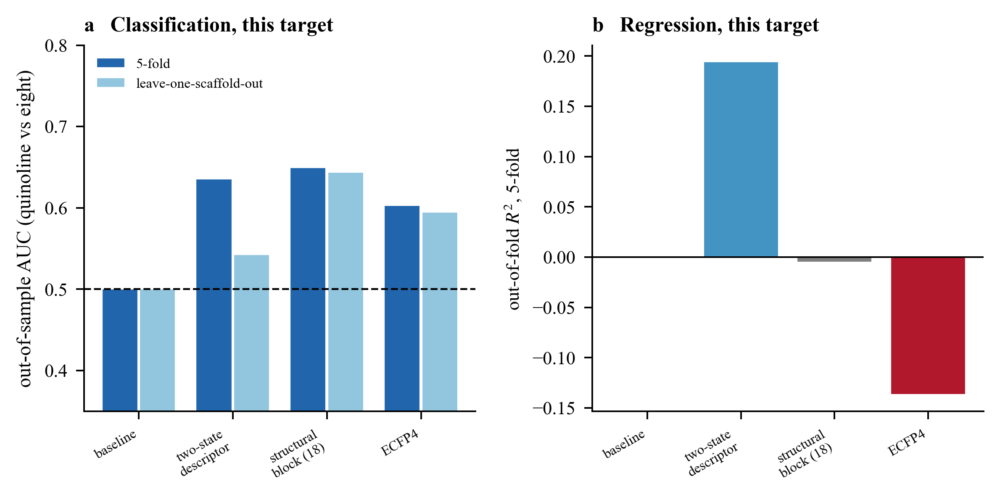
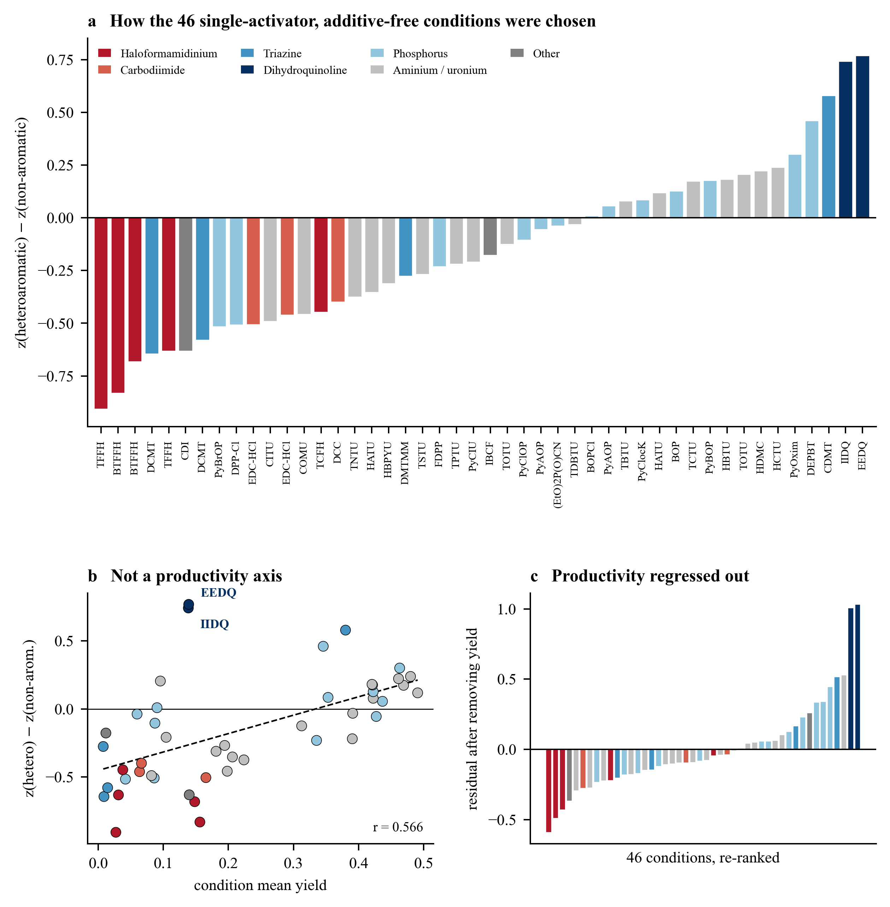
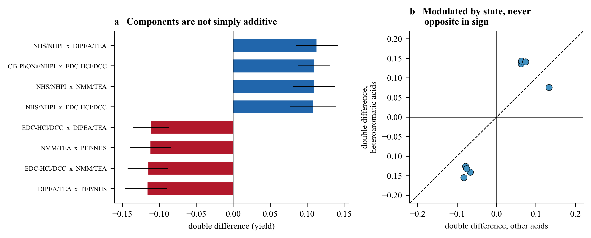
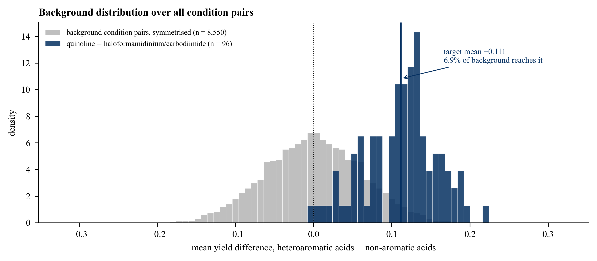

# Supplementary Information

**Mapping the Substrate Dependence of Amide-Coupling Activators from a High-Throughput Reaction Screen**

All values recompute from the two dataset files (the acylation subset of an in-house dataset,
complete) and the frozen five-fold scaffold partition, via an accompanying script that imports no
function from the code that generated the figures.

---

## Supplementary Note 1 | Candidate descriptors

Eighteen descriptors were written into a file and frozen before any of them was computed against
a yield. All are functions of the acid SMILES alone. The attachment atom is the non-carbonyl
neighbour of the carboxyl carbon; the attached ring system is the fused aromatic ring system
containing that atom. D11 and D12 are Gasteiger partial charges [59].

| id | descriptor | type | definition |
|---|---|---|---|
| D1 | ring system state | 3-level | heteroaromatic / carbocyclic aryl / non-aromatic, on the fused ring system |
| D2 | aromatic attachment | binary | aromatic attachment atom, of either ring type |
| D3 | heteroaromatic vs rest | binary | the two-state form used in the manuscript |
| D4 | attached-ring heteroatom | binary | heteroatom in the single ring bearing the attachment, not the fused system |
| D5 | any aromatic heteroatom | binary | an aromatic heteroatom anywhere in the molecule |
| D6 | heteroatom element | 3 binaries | N, O, S present in the attached ring system |
| D7 | heteroatom count | integer | heteroatoms in the attached aromatic ring system |
| D8 | ring system class | categorical | benzene, pyridine, thiophene, furan, benzofuran, benzothiophene, quinoline, quinoxaline, pyrimidine, pyrazine, imidazole, pyrazole, indole, naphthalene, aliphatic |
| D9 | distance to ring heteroatom | ordinal | shortest bond path from the carboxyl carbon to the nearest aromatic ring heteroatom |
| D10 | heteroatom adjacent | binary | a ring heteroatom bonded directly to the attachment atom |
| D11 | hydroxyl oxygen charge | continuous | Gasteiger partial charge on the carboxyl hydroxyl oxygen |
| D12 | carboxyl carbon charge | continuous | Gasteiger partial charge on the carboxyl carbon |
| D13 | attachment heavy degree | integer | heavy-atom degree of the attachment atom |
| D14 | ortho substituents | integer | non-hydrogen substituents on atoms adjacent to the attachment atom |
| D15 | rotatable bonds | integer | RDKit `NumRotatableBonds` |
| D16 | molecular weight | continuous | pre-declared control |
| D17 | topological polar surface area | continuous | pre-declared control |
| D18 | calculated logP | continuous | pre-declared control |

D9 and D10 encode the graph-distance description that an earlier exploration of these data had
considered. They are retained in the frozen list and tested rather than assumed dead. D9 is scored
by one-hot encoding, as for D1 and D8, not as a single ordinal column. D9 ranks 6th, 18th, 12th,
11th and 6th across the five responses, whereas D10 ranks 2nd, 2nd, 6th, 4th and 2nd: their
performance is response-dependent, not uniformly comparable to D3.

---

## Supplementary Note 2 | Pre-registration record and the full descriptor contest

The main text reports a fair, common-split comparison between the two-state descriptor and the
carboxyl-carbon charge on the raw per-acid targets (Figure 4). This note holds the registration
record for the earlier, pre-registered descriptor contest, together with the full five-response
comparison and the material that does not fit the main text.

**Registration record.** Each file was frozen before any quantity it governs was computed.

| stage | frozen |
|---|---|
| Stage 1 pre-registration | before any Stage 1 quantity computed |
| Amendment 1 (response specification) | after primary scoring, before the amended response computed |
| Stage 2 pre-registration | before any Stage 2 quantity computed |
| Stage 3 pre-registration | before any Stage 3 quantity computed |

All four are included in `preregistration/` at
https://github.com/TheLiaoGroup/amide-coupling-activator-response. Stage 1 and Amendment 1 are two
states of the same working document (the amendment was appended to the frozen Stage 1 file rather
than written to a new one); `Stage1_preregistration.md` there is the exact byte-for-byte Stage 1
content split back out (see `preregistration/README.md` in the repository for the full account).

**Why Amendment 1.** After the pre-registered primary response, `pc1_loading`, was scored, a
diagnostic showed it was built on a mode whose condition-side component tracks which conditions are
more productive rather than which acids they prefer: that component correlates with condition mean
yield at r = 0.879. An amended response, `pc1_resid_loading` (called the productivity-orthogonalised
response below), was added alongside it, projecting condition mean yield out of the matrix before
scoring; `pc1_loading`'s own result is reported in full in the table below, not replaced.

**The control that fired.** On the productivity-orthogonalised response, topological polar surface
area reached out-of-fold R² = 0.075 with a permutation p of 0.0015, above every chemical
descriptor, while the incumbent scored −0.109. TPSA was checked and is not a proxy for the
hypothesis: its correlation with the heteroaromatic indicator is 0.25, and the highest-TPSA acids
in the set are nitroaryl and Boc/Cbz-protected amino acids rather than heteroaromatics. The
pre-registered rule treats a significant control as evidence that the response is too noisy for a
descriptor contest, and forbids reading the gate on it. That rule was followed.

**What the gate did not settle.** Whether the ring-system assignment is the best available
descriptor. It ranks first on one response and fifteenth on another, and no response is both
pre-registered and passing its own control check. The two-state form is used throughout because it scores higher than the three-state form on all
three pre-registered responses and one of the two post-hoc ones, and lower on the remaining
post-hoc response by 0.003.

**The full five-response contest.** All five responses are scored against the same eighteen
pre-registered candidates, so the ranks are comparable across rows.

| response | pre-registered | two-state (D3) R² | rank of 18 | best control scores below D3 |
|---|---|---|---|---|
| leading interaction mode | yes, primary | +0.076 | 4 | yes |
| productivity-orthogonalised mode | yes, amendment | +0.015 | 4 | **no** |
| BTFFH − EEDQ contrast | yes, secondary | +0.178 | 5 | yes |
| quinoline vs the eight | no, post hoc | +0.190 | 5 | yes |
| CDMT/DEPBT/PyOxim vs the eight | no, post hoc | +0.265 | 3 | yes |

This is the two-state form (D3); the incumbent used for the pre-registered gate above is the
three-state form (D1), which the two-state form beats on four of these five responses. The
EEDQ − BTFFH target used for the fair descriptor comparison in the main text (Figure 4) is the
sign-reversed form of the "BTFFH − EEDQ contrast" secondary response above; Figure 4 reanalyses it,
together with the separate IIDQ − BTFFH target (which was not part of the Stage 1 pre-registration),
fitting one descriptor at a time, and once more with both descriptors together, by ordinary least
squares under leave-one-scaffold-out - the same per-descriptor OLS approach as the five-response
contest above, using a different validation scheme, with IIDQ − BTFFH included as a separate
target. This is
different from the ridge/logistic protocol used below for the full 18-descriptor block and ECFP4
fingerprint comparison, which needs regularisation because that design matrix is near-singular.

**A note on method.** The failure was in specifying the response, not the descriptor. A response
intended to isolate a substrate × condition preference should be pre-registered together with a
check that it does not correlate with overall productivity. It was not, and the first response
chosen turned out to be a productivity axis.

One deviation from a frozen scheme is recorded, in Supplementary Note 8.

---

## Supplementary Note 3 | Cross-validation

The acid is the unit throughout (n = 71). Groups are Bemis–Murcko scaffolds, of which there are
32; the largest holds 25 acids, because benzoic and phenylacetic acids share the benzene scaffold
and therefore fall in one group even though they belong to different acid classes. This makes the
grouping conservative rather than convenient.

Amines are not held out by this split. Most amines paired with a scaffold group held out in one
fold also appear with acids from other scaffold groups elsewhere in the array, but 14 of the 82
amines pair with acids from only one scaffold group, so the evaluation does not constitute a
dedicated test in which both acid and amine identities are simultaneously held out.

Random splitting is not used at any point. Acids sharing a scaffold placed on both sides of a
split inflate the apparent score, because the model can then recognise a near-duplicate rather
than generalise.

`GroupKFold` with five folds necessarily places the entire 25-member scaffold group in a single
fold; leave-one-scaffold-out instead holds out each of the 32 scaffold groups individually, and is
used where noted below. Not every score is reported under both: the five-response comparison above
and the regression panel of Supplementary Figure S3 use five-fold `GroupKFold` only, the
classification panel of Supplementary Figure S3 reports both five-fold and leave-one-scaffold-out,
and the main-text fair comparison (Figure 4) uses leave-one-scaffold-out only. Ridge regularisation
(α = 1.0) and logistic regression regularisation (C = 1.0) are fixed, chosen before any model was
fitted and never tuned; within this fitting pipeline, no feature selection occurs inside or outside
the folds. Permutation tests shuffle the descriptor across acids while holding the fold structure
fixed.

This is the protocol behind Supplementary Figure S3, which compares the full 18-descriptor block
and a 2,048-bit ECFP4 fingerprint against the two-state descriptor on the quinoline-family-contrast
target ("quinoline vs the eight" in the five-response table of Supplementary Note 2; three of that
table's five responses were pre-registered, and this is one of the two marked post hoc). On the
regression form of this target neither the larger block nor the fingerprint outperforms the
two-state descriptor (out-of-fold R², five-fold: 0.194 for the two-state descriptor against −0.005
for the block and −0.137 for the fingerprint; leave-one-scaffold-out, two-state descriptor only:
0.179). On the classification form the picture depends on
the split: five-fold AUC is 0.635 (two-state), 0.650 (block) and 0.603 (fingerprint), so only the
block scores higher than the two-state descriptor; leave-one-scaffold-out AUC is 0.542 (two-state),
0.644 (block) and 0.595 (fingerprint), so both the block and the fingerprint score higher than the
two-state descriptor under this stricter split. The two-state descriptor's leave-one-scaffold-out
classification is asymmetric: it correctly calls 36 of the 43 acids that do not prefer the
quinoline end but only 14 of the 28 that do, so it identifies non-preference more reliably than
preference on this target. The main-text fair comparison (Figure 4) uses a related but distinct
target - the raw per-acid EEDQ − BTFFH and IIDQ − BTFFH differences - and a simpler ordinary-least-squares
fit with no regularisation to compare, since only two candidates (the two-state descriptor and the
carboxyl-carbon charge) are being compared rather than eighteen.

**Supplementary Figure S3 | The full descriptor block and a general-purpose fingerprint do not
outperform the two-state descriptor in regression; in classification the block edges ahead on both
splits and the fingerprint edges ahead only on leave-one-scaffold-out.**
**a**, Classification AUC. **b**, Regression R², five-fold.

---

## Supplementary Note 4 | Yield-floor sensitivity

Some conditions in the array are nearly unproductive, and a standardised class difference computed
on such a condition is dominated by noise. Rather than impose a floor, we report the analysis
across floors.

| floor on condition mean yield | conditions | axis dispersion | permuted null | p | top two activators | r(axis, yield) |
|---|---|---|---|---|---|---|
| none | 46 | 0.396 | 0.202 | < 0.001 | EEDQ, IIDQ | +0.566 |
| 0.01 | 44 | 0.398 | 0.195 | < 0.001 | EEDQ, IIDQ | +0.551 |
| 0.02 | 42 | 0.401 | 0.188 | < 0.001 | EEDQ, IIDQ | +0.543 |
| 0.05 | 38 | 0.381 | 0.179 | < 0.001 | EEDQ, IIDQ | +0.450 |
| 0.10 | 30 | 0.399 | 0.156 | < 0.001 | EEDQ, IIDQ | +0.440 |

The dispersion test is significant at every floor and the two dihydroquinolines remain first and
second among the survivors in every case. The correlation with productivity falls as the floor
rises, indicating that the entanglement is contributed disproportionately by the least productive
conditions rather than by the effect itself. At a floor of 0.15 the quinolines themselves are
excluded, since their mean yields are 0.139 and 0.138.

---

## Supplementary Note 5 | The label-free mode is preprocessing-dependent and is not used as evidence

A decomposition of the acid × condition matrix that uses no class label at all can be made to
place EEDQ and IIDQ at the top of the array. We report it here rather than in the main text
because the result does not survive contact with reasonable alternatives.

Two preprocessing choices are involved: whether acid means are standardised within each condition,
and whether the condition-mean-yield direction is projected out before decomposition. Both are
defensible individually — the first is the analysis's own convention, the second is the control a
referee would demand — and each combination was run under both a complete-case and a mean-filled
treatment of the missing cells. The decomposition itself uses no class label; each row's sign is
then oriented so the leading mode's acid-loading correlates non-negatively with the heteroaromatic
indicator, since SVD fixes no sign otherwise — this labels a direction already present in the
label-free result, it does not change which acids or conditions are grouped together.

| within-condition z | missing values | productivity projected out | acids | PC1 variance | EEDQ rank | IIDQ rank | r(loading, heteroaryl) |
|---|---|---|---|---|---|---|---|
| yes | complete-case | yes | 65 | 0.169 | 2 | 1 | +0.227 |
| yes | complete-case | no | 65 | 0.244 | 5 | 2 | +0.376 |
| yes | mean-filled | yes | 71 | 0.171 | 1 | 5 | +0.194 |
| yes | mean-filled | no | 71 | 0.223 | 14 | 22 | +0.339 |
| no | complete-case | yes | 65 | 0.221 | 8 | 9 | +0.008 |
| no | complete-case | no | 65 | 0.496 | 23 | 25 | +0.149 |
| no | mean-filled | yes | 71 | 0.242 | 39 | 37 | +0.065 |
| no | mean-filled | no | 71 | 0.523 | 23 | 27 | +0.136 |

Only the complete-case variant that applies both steps places both dihydroquinolines in the top
two (EEDQ 2nd, IIDQ 1st); the mean-filled variant under the same two steps puts EEDQ 1st but IIDQ
only 5th. In the remaining six variants EEDQ ranks between 5th and 39th. Even in the favourable variants the leading mode
carries 17% of the variance and its substrate loadings correlate with the heteroaromatic indicator
at only 0.19–0.23, so the mode is not principally the heteroaromatic axis even where the condition
ordering comes out as expected. We therefore make no claim that the axis recovers itself without
labels.

---

## Supplementary Note 6 | All 46 conditions

Axis coordinate is the mean within-condition z of the 21 heteroaromatic acids minus that of the 32
non-aromatic acids. Residual is after regressing the axis on condition mean yield across these 46
conditions. All conditions are DMF, 25 °C, 2 h, activator with no additive.

**Supplementary Figure S1 | The activator axis behind the family separation reported in the main
text.** **a**, All 46 single-activator conditions, ordered by axis coordinate and coloured by
reagent family; this is the additive-free condition set that BTFFH, EEDQ and IIDQ (main-text
Figure 2) are drawn from.
**b**, The axis is not a productivity axis (r = 0.566, but the two most positive conditions are
among the least productive). **c**, The same axis after condition mean yield is regressed out.

| condition | activator | base | family | wells | mean yield | axis | residual |
|---|---|---|---|---|---|---|---|
| C48 | TFFH | NMM | Haloformamidinium | 574 | 0.027 | -0.907 | -0.491 |
| C3 | BTFFH | DIPEA | Haloformamidinium | 564 | 0.156 | -0.832 | -0.591 |
| C49 | BTFFH | NMM | Haloformamidinium | 539 | 0.148 | -0.682 | -0.431 |
| C4 | DCMT | DIPEA | Triazine | 570 | 0.009 | -0.644 | -0.204 |
| C2 | TFFH | DIPEA | Haloformamidinium | 568 | 0.031 | -0.632 | -0.222 |
| C63 | CDI | DBU | Other | 566 | 0.140 | -0.631 | -0.369 |
| C50 | DCMT | NMM | Triazine | 575 | 0.014 | -0.579 | -0.147 |
| C39 | PyBrOP | DIPEA | Phosphorus | 564 | 0.042 | -0.516 | -0.121 |
| C43 | DPP-Cl | DIPEA | Phosphorus | 573 | 0.086 | -0.508 | -0.172 |
| C87 | EDC-HCl | none | Carbodiimide | 572 | 0.165 | -0.505 | -0.277 |
| C59 | CITU | NMM | Aminium / uronium | 562 | 0.082 | -0.490 | -0.149 |
| C47 | EDC-HCl | NMM | Carbodiimide | 570 | 0.063 | -0.461 | -0.095 |
| C5 | COMU | 2,6-lutidine | Aminium / uronium | 561 | 0.198 | -0.458 | -0.274 |
| C76 | TCFH | NMI | Haloformamidinium | 571 | 0.038 | -0.448 | -0.047 |
| C77 | DCC | none | Carbodiimide | 574 | 0.066 | -0.399 | -0.037 |
| C10 | TNTU | DIPEA | Aminium / uronium | 571 | 0.224 | -0.375 | -0.225 |
| C92 | HATU | none | Aminium / uronium | 575 | 0.206 | -0.353 | -0.180 |
| C94 | HBPYU | none | Aminium / uronium | 575 | 0.181 | -0.311 | -0.104 |
| C44 | DMTMM | DIPEA | Triazine | 574 | 0.008 | -0.276 | +0.165 |
| C12 | TSTU | DIPEA | Aminium / uronium | 568 | 0.194 | -0.269 | -0.079 |
| C18 | FDPP | DIPEA | Phosphorus | 573 | 0.336 | -0.232 | -0.233 |
| C11 | TPTU | DIPEA | Aminium / uronium | 567 | 0.390 | -0.220 | -0.296 |
| C45 | PyCIU | DIPEA | Aminium / uronium | 574 | 0.104 | -0.209 | +0.102 |
| C72 | IBCF | NMM | Other | 547 | 0.012 | -0.177 | +0.259 |
| C24 | TOTU | DIPEA | Aminium / uronium | 567 | 0.313 | -0.125 | -0.095 |
| C16 | PyClOP | DIPEA | Phosphorus | 569 | 0.087 | -0.105 | +0.229 |
| C61 | PyAOP | NMM | Phosphorus | 573 | 0.427 | -0.056 | -0.181 |
| C17 | (EtO)2P(O)CN | DIPEA | Phosphorus | 546 | 0.060 | -0.038 | +0.333 |
| C9 | TDBTU | DIPEA | Aminium / uronium | 540 | 0.391 | -0.032 | -0.109 |
| C46 | BOPCl | DMAP | Phosphorus | 571 | 0.090 | +0.009 | +0.339 |
| C33 | PyAOP | DIPEA | Phosphorus | 559 | 0.437 | +0.056 | -0.083 |
| C6 | TBTU | DIPEA | Aminium / uronium | 559 | 0.423 | +0.078 | -0.041 |
| C40 | PyClocK | DIPEA | Phosphorus | 573 | 0.353 | +0.085 | +0.059 |
| C20 | HATU | DIPEA | Aminium / uronium | 576 | 0.491 | +0.118 | -0.094 |
| C14 | BOP | DIPEA | Phosphorus | 572 | 0.423 | +0.127 | +0.007 |
| C8 | TCTU | DIPEA | Aminium / uronium | 554 | 0.469 | +0.173 | -0.009 |
| C35 | PyBOP | DIPEA | Phosphorus | 574 | 0.422 | +0.176 | +0.057 |
| C22 | HBTU | DIPEA | Aminium / uronium | 571 | 0.421 | +0.181 | +0.063 |
| C96 | TOTU | none | Aminium / uronium | 545 | 0.095 | +0.205 | +0.528 |
| C7 | HDMC | DIPEA | Aminium / uronium | 558 | 0.461 | +0.222 | +0.050 |
| C23 | HCTU | DIPEA | Aminium / uronium | 574 | 0.480 | +0.239 | +0.041 |
| C37 | PyOxim | DIPEA | Phosphorus | 577 | 0.463 | +0.300 | +0.126 |
| C42 | DEPBT | DIPEA | Phosphorus | 573 | 0.346 | +0.460 | +0.444 |
| C64 | CDMT | NMM | Triazine | 557 | 0.380 | +0.579 | +0.517 |
| C95 | IIDQ | DIPEA | Dihydroquinoline | 573 | 0.138 | +0.741 | +1.006 |
| C41 | EEDQ | DIPEA | Dihydroquinoline | 566 | 0.139 | +0.768 | +1.032 |

Seven activators appear twice. Four agree in sign — BTFFH (−0.83, −0.68), TFFH (−0.91, −0.63),
DCMT (−0.64, −0.58), EDC·HCl (−0.51, −0.46) — and three disagree: HATU (−0.35, +0.12),
PyAOP (−0.06, +0.06) and TOTU (−0.13, +0.21). All three disagreements sit near zero, so sign
replication holds where the effect is large and fails where it is small. Neither dihydroquinoline
is replicated within reagent.

---

## Supplementary Note 7 | Cross-family support at the positive end

Both dihydroquinoline conditions were deleted and the axis rebuilt on the remaining 44 conditions.

| test | result |
|---|---|
| CDMT alone | axis +0.579, p = 0.039 |
| DEPBT alone | axis +0.460, p = 0.105 |
| PyOxim alone | axis +0.300, p = 0.290 |
| the three pooled, against the eight haloformamidinium/carbodiimide conditions | heteroaromatic +0.66, carbocyclic aryl −0.07, non-aromatic −0.39; difference +1.05 (95% CI +0.63 to +1.45), p < 0.0001 |
| dispersion on the reduced array | 0.353 against a null of 0.199, p = 0.002 |
| r(axis, condition mean yield) | rises from +0.566 to +0.716 |
| residual ranks after regressing out mean yield | CDMT 2/44, DEPBT 3/44, PyOxim 10/44 |

Deleting the dihydroquinolines *increases* the entanglement with productivity, because those two
conditions are precisely the low-yielding points that break the productivity trend. The
residualised test is therefore load-bearing rather than confirmatory. Only CDMT is individually
significant; the trio carries the claim when pooled, and PyOxim contributes little once
productivity is removed.

---

## Supplementary Note 8 | Amine classification, and one deviation from the frozen scheme

Amines are classified from the nitrogen that forms the amide: the least-substituted non-aromatic
nitrogen bearing at least one hydrogen and not part of an amide or sulfonamide. No amine in the
set has more than one candidate nitrogen under this rule.

| class | amines | cells | heteroaromatic acids | other acids | contrast | 95% CI |
|---|---|---|---|---|---|---|
| aniline | 34 | 287 | +0.484 | −0.367 | +0.851 | +0.536 to +1.185 |
| heteroaryl amine | 11 | 56 | +0.432 | −0.415 | +0.846 | +0.348 to +1.370 |
| aliphatic primary | 18 | 147 | +1.121 | −0.117 | +1.238 | +0.671 to +1.813 |
| aliphatic secondary | 12 | 64 | +0.525 | −0.189 | +0.714 | +0.047 to +1.438 |
| primary sulfonamide | 7 | 24 | +0.194 | +0.073 | +0.121 | −0.303 to +0.549 |

Homogeneity of the acid-state effect across classes: permutation on amine class labels gives
p = 0.61 on the four registered classes and p = 0.14 with sulfonamides included. Sign consistency
with the amine as the unit: 27 of 30 amines, binomial p = 8.4 × 10⁻⁶. The companion split by
hydrogen count alone gives +0.833 for primary and +0.714 for secondary amines.

**Deviation.** The frozen rule excluded sulfonamide nitrogen as non-nucleophilic. In seven amines
the primary sulfonamide is the only nitrogen present, so the rule left them unclassified rather
than ambiguous. They were added as a fifth class and both tests rerun; the conclusion is
unchanged. Their effect is flat rather than reversed, which is consistent with these being the
weakest nucleophiles in the set, where the whole contrast compresses toward zero. Seven amines and
24 cells do not support a stronger statement.

**Coverage limit.** Only 30 of the 82 amines carry at least three acids of each class, because the
array is a fixed 578-pair library rather than a full 71 × 82 cross. The sign-consistency test
speaks for those 30.

---

## Supplementary Note 9 | Quadrangle enumeration

A condition is canonicalised as the multiset of (compound identifier, equivalents) over its six
reagent slots together with solvent identifier, temperature and time. Slot order is irrelevant, so
the same reagent entered in different slots in two conditions does not create a spurious
difference.

Two conditions form a **single-factor edge** when their canonical sets differ by exactly one
element **and both sides of the difference are non-empty** — that is, a substitution of one
component for another, not the presence or absence of a component. A **strict quadrangle** is four
conditions of one screen wired as a 2 × 2 by two such edges, with the two parallel edges carrying
the same substitution.

The substitution-only requirement is not cosmetic. Admitting presence/absence edges introduces a
stronger quadrangle than any reported here (−0.134, DCC/EDC·HCl against no additive/ethyl
cyanoglyoxylate-2-oxime), in which one arm has a component the other lacks; the double difference
then confounds the effect of substituting a component with the effect of having one at all.

Seventy-seven strict quadrangles exist within this screen, all with at least 507 shared substrate
pairs. Eight reach a double difference of 0.10 or more in absolute value, and all eight lie in the
carbodiimide sub-block.

**Supplementary Figure S4 | Components are not simply additive, and the acid modulates the size of
the interaction, never its sign.**
**a**, The eight strict quadrangles reaching a double difference of 0.10, with 95% cluster
bootstrap intervals over acids.
**b**, The same eight quadrangles with the double difference computed separately for
heteroaromatic and other acids.

| quadrangle | factors | pairs | double difference | 95% CI | heteroaromatic | other |
|---|---|---|---|---|---|---|
| C30,C71 / C31,C70 | DIPEA/TEA × pentafluorophenol/NHS | 548 | −0.116 | −0.146 to −0.089 | −0.155 | −0.083 |
| C53,C57 / C68,C70 | EDC·HCl/DCC × NMM/TEA | 543 | −0.115 | −0.143 to −0.088 | −0.126 | −0.079 |
| C56,C71 / C57,C70 | NMM/TEA × pentafluorophenol/NHS | 545 | −0.112 | −0.140 to −0.084 | −0.141 | −0.067 |
| C27,C31 / C68,C70 | EDC·HCl/DCC × DIPEA/TEA | 556 | −0.112 | −0.135 to −0.087 | −0.132 | −0.076 |
| C68,C69 / C70,C73 | NHS/NHPI × EDC·HCl/DCC | 527 | +0.108 | +0.077 to +0.140 | +0.136 | +0.063 |
| C57,C58 / C70,C73 | NHS/NHPI × NMM/TEA | 526 | +0.109 | +0.081 to +0.138 | +0.143 | +0.063 |
| C51,C54 / C55,C58 | 2,4,5-trichlorophenolate/NHPI × EDC·HCl/DCC | 527 | +0.110 | +0.088 to +0.130 | +0.076 | +0.133 |
| C31,C32 / C70,C73 | NHS/NHPI × DIPEA/TEA | 531 | +0.113 | +0.085 to +0.142 | +0.141 | +0.073 |

Intervals are 95% cluster bootstrap resampling acids and taking all their substrate pairs. Six of
the eight show a state difference significant at p < 0.05 by the same acid-class-label permutation
used throughout the paper, applied to per-acid means; none changes sign between states. In one quadrangle
(2,4,5-trichlorophenolate/NHPI × EDC·HCl/DCC) the interaction is larger for the other acids than
for the heteroaromatic ones, so "larger for heteroaromatic acids" holds in seven of eight and is
not claimed as a rule.

---

## Supplementary Note 10 | Activator families, and the background distribution over condition pairs

### Family membership, enumerated

Families are assigned from the `Reagent1` identity by explicit membership lists, not by pattern
matching on names. Every member is listed here so the assignment can be checked entry by entry.
In this screen the activator is always the `Reagent1` entry, so no family member can hide in
another slot or inside a pre-formed complex name.

| family | activator | CAS | conditions | activator equiv | condition ids |
|---|---|---|---|---|---|
| quinoline | EEDQ | 16357-59-8 | 1 | 1.5 | C41 |
| quinoline | IIDQ | 38428-14-7 | 1 | 1.5 | C95 |
| haloformamidinium | BTFFH | 164298-25-3 | 2 | 1.5 | C3, C49 |
| haloformamidinium | TCFH | 94790-35-9 | 1 | 1.5 | C76 |
| haloformamidinium | TFFH | 164298-23-1 | 3 | 1.5 | C2, C48, C62 |
| carbodiimide | DCC | 538-75-0 | 17 | 1.5 | C29, C30, C31, C32, C55, C56, C57, C58, C70, C71, C73, C77, C78, C79, C80, C81, C82 |
| carbodiimide | DIC | 693-13-0 | 5 | 1.5 | C66, C83, C84, C85, C86 |
| carbodiimide | EDC-HCl | 25952-53-8 | 20 | 1.5 | C13, C25, C26, C27, C28, C47, C51, C52, C53, C54, C60, C67, C68, C69, C74, C87, C88, C89, C90, C91 |

All eight activators enter at **1.5 equiv**, so the 96 target pairs compare two arms at identical
activator loading and the contrast cannot be a loading artefact.

Two nomenclature points, checked against the CAS registry numbers above. TCFH (94790-35-9) is a
**chloro**formamidinium, not a fluoroformamidinium, so the family containing TFFH, BTFFH and TCFH
is named haloformamidinium throughout. Elsewhere in the array, PyOxim is an oxime **phosphonium**
and is grouped with the phosphorus reagents, while TSTU, TNTU and TPTU are succinimidyl,
norbornene-imido and pyridone uroniums rather than benzotriazole ones; the family holding them is
therefore named aminium/uronium.

### The background construction, and why its sign is not a result

Every one of the 4,371 unordered pairs of the 94 conditions is estimable at the floor of five
acids per class, so none is discarded. Ninety-six pairs oppose a quinoline condition to a
haloformamidinium or carbodiimide condition; the remaining 4,275 form the background.

A background pair is **unordered**, so the sign of its difference depends on which condition is
enumerated first. Taken in enumeration order, 54.6% of background pairs are negative; taken in the
reverse order, 45.4% are. The two necessarily sum to one. Reporting either as a property of the
data would be reporting the enumeration order.

The background is therefore **symmetrised**: each pair enters twice, as (x, y) and as (y, x). The
symmetrised distribution has mean 0 and a 50/50 sign split **by construction**, and neither is
reported as a finding. The one quantity that carries information is where the target group sits
in it: **293 of the 4,275 distinct background pairs, 6.85%, reach the target group's mean of
+0.1114 in absolute value** (equivalently, 293 of the 8,550 symmetrised entries reach it in the
positive direction alone — the same 293 pairs, since a pair's two mirrored entries can never both
clear a positive threshold, so 8,550 is not the right denominator for the reaching-fraction).

The target group is *not* symmetrised. Its orientation — quinoline minus haloformamidinium or
carbodiimide — is fixed by chemistry rather than by enumeration, which is what makes its mean of
+0.1114 and its 95-of-96 positive count reportable.

**Supplementary Figure S2 | The target group against the array's own background spread.** Grey:
the 4,275 symmetrised background pairs. Navy: the 96 target pairs, oriented quinoline minus other
and not symmetrised. 6.85% of the distinct background pairs reach the target mean in absolute
value.

An internal check asserts that the background negative fractions in the two enumeration orders sum
to one, so that a future change which silently drops the symmetrisation fails the check rather than
passing it.

### What this does and does not settle

It bounds how much of the activator-family effect could be ordinary variation between conditions,
and it does so empirically rather than through a distributional assumption. It is reported as a
quantile and not as a p-value, because the background pairs share conditions and are not
independent.

It does **not** remove the limitation, described in the main text (Discussion) and bounded further in
Supplementary Note 7, that the positive end of the axis rests on two conditions, one per reagent,
both dihydroquinolines, neither replicated within reagent. The background distribution shows their
separation is not what sampling variation between conditions ordinarily produces; it does not
supply a second quinoline condition.

---

## Supplementary Note 11 | Absolute yields by acid class

The activator axis is a statement about relative preference within a condition. It is not a
statement about absolute yield, and the two orderings differ. This note gives the absolute
figures so that the distinction is checkable rather than asserted.

Values are class means with the acid as the unit: each acid's value is first averaged over
whichever amines it was measured against under that condition (1 to 32 of the 82, mean 8.0), then
acids are averaged within class. The last column is the condition's rank among all 94 by overall
mean yield.

| condition | activator | O/S heteroaryl | N heteroaryl | carbocyclic | non-aromatic | all conditions rank |
|---|---|---|---|---|---|---|
| C20 | HATU | 0.603 | 0.441 | 0.448 | 0.462 | 1 of 94 |
| C23 | HCTU | 0.637 | 0.424 | 0.433 | 0.436 | 2 of 94 |
| C8 | TCTU | 0.590 | 0.419 | 0.434 | 0.433 | 3 of 94 |
| C37 | PyOxim | 0.608 | 0.432 | 0.442 | 0.420 | 4 of 94 |
| C7 | HDMC | 0.596 | 0.419 | 0.435 | 0.424 | 5 of 94 |
| C33 | PyAOP | 0.582 | 0.366 | 0.370 | 0.416 | 6 of 94 |
| C61 | PyAOP | 0.541 | 0.340 | 0.372 | 0.409 | 7 of 94 |
| C14 | BOP | 0.564 | 0.369 | 0.394 | 0.402 | 8 of 94 |
| C6 | TBTU | 0.511 | 0.387 | 0.385 | 0.407 | 9 of 94 |
| C35 | PyBOP | 0.554 | 0.382 | 0.380 | 0.395 | 10 of 94 |
| C41 | EEDQ | 0.288 | 0.147 | 0.099 | 0.091 | 66 of 94 |
| C95 | IIDQ | 0.235 | 0.145 | 0.099 | 0.087 | 67 of 94 |
| C3 | BTFFH | 0.076 | 0.096 | 0.115 | 0.186 | 63 of 94 |
| C2 | TFFH | 0.005 | 0.006 | 0.032 | 0.038 | 86 of 94 |
| C77 | DCC | 0.054 | 0.059 | 0.046 | 0.082 | 79 of 94 |
| C87 | EDC-HCl | 0.187 | 0.096 | 0.150 | 0.182 | 61 of 94 |

Read across the top block: under the most productive conditions the acids whose ring system
carries oxygen or sulfur give the highest class mean of the four, and they do so in **all 23** of
the most productive quarter of the 94 conditions. Under the dihydroquinolines they are also the
highest class, but at roughly half the absolute value; under the haloformamidiniums they are the
lowest. The class ordering therefore reverses across the array; this "highest of the four" pattern
is established for the most productive quarter of conditions and does not extend to the array as a
whole (e.g., under DCC/DIPEA/NHS and DCC/NMM/pentafluorophenol the non-aromatic mean exceeds the
O/S-heteroaryl mean).

Two consequences follow. First, EEDQ ranks **19th of the 46** axis conditions (Supplementary
Figure S1) on absolute yield for the 21 heteroaromatic acids (0.187 under EEDQ against 0.487 under
HATU); for the six O/S acids it is 0.288 against 0.637 under HCTU. Second, the paper's claim is
about where a substrate class sits relative to others under a given activator, and a reader looking
for the highest yield on a heteroaromatic acid should read the top of this table, not the top of
the axis in Supplementary Figure S1.
